# 🏡 BienesRaíces

Proyecto web completo para la administración de propiedades inmobiliarias. Permite la gestión de anuncios, vendedores y creación/modificación de contenidos. Desarrollado con enfoque en arquitectura MVC, buenas prácticas y herramientas modernas de desarrollo frontend.

---

## 📌 Características

- Sistema CRUD de propiedades y vendedores.
- Panel de administración.
- Subida de imágenes.
- Estilo responsivo.
- Optimización con Gulp, SASS y minificación de CSS/JS.
- Arquitectura MVC pura (PHP sin frameworks).

---

## 🛠️ Tecnologías utilizadas

- PHP (sin framework)
- MySQL
- HTML5, CSS3, SASS
- Gulp
- JavaScript (Vanilla)
- Composer

---

## 📁 Estructura de carpetas

proyecto5_bienesraices/
│
├── includes/ # Configuración y funciones reutilizables
│ ├── config/ # Base de datos y constantes
│ ├── funciones.php # Funciones generales
│
├── controllers/ # Lógica del sistema (controladores)
├── models/ # Clases de entidades (Propiedad, Vendedor, etc.)
├── views/ # Plantillas de vistas (HTML)
│
├── public/ # Punto de entrada del sistema (accesible desde el navegador)
│ ├── index.php # Página principal
│ └── admin/ # Panel de administración
│
├── src/ # Archivos fuente (SASS, JS sin compilar)
├── build/ # Archivos compilados con Gulp
├── screenshots/ # Capturas de pantalla para documentación
├── .env # Archivo con variables sensibles (NO se sube a Git)
├── gulpfile.js # Configuración de Gulp
├── composer.json # Dependencias PHP
└── package.json # Dependencias frontend (Gulp, etc.)

---

## 📷 Capturas de pantalla

### Página de inicio
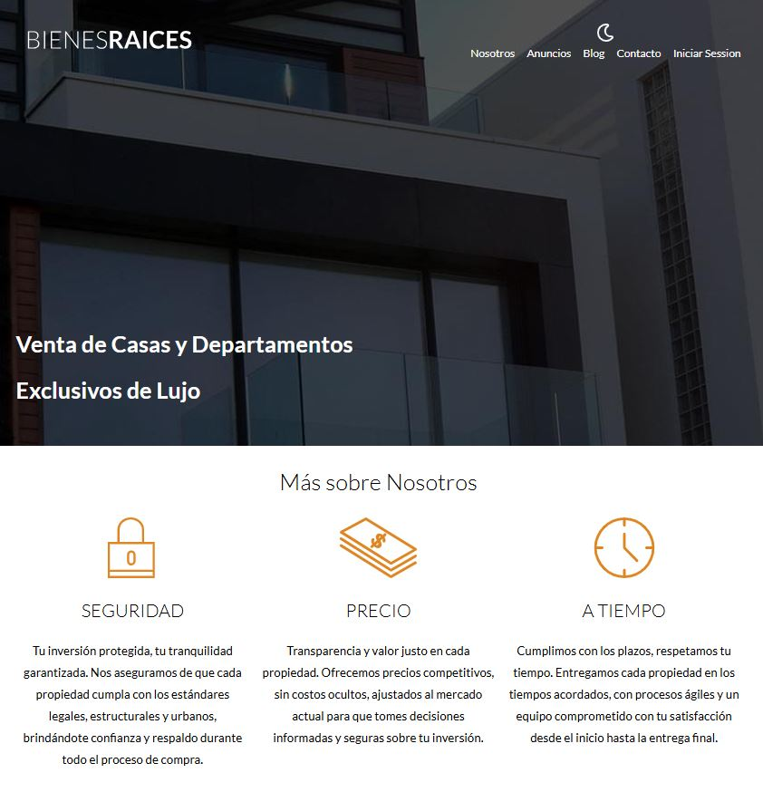

### Casas y Departamentos
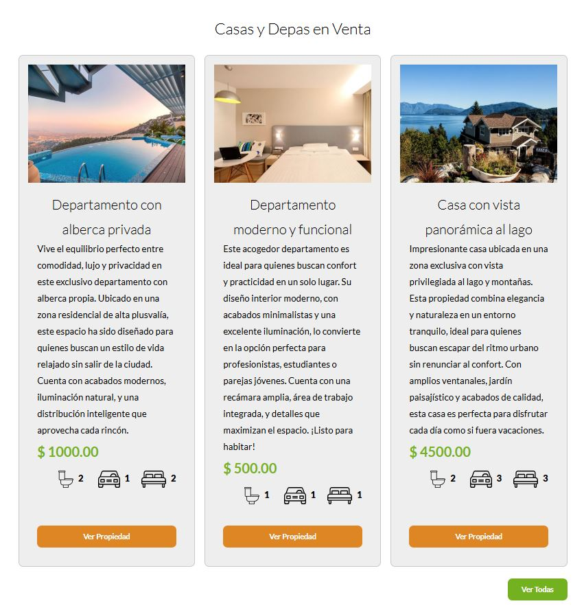

### Contactanos
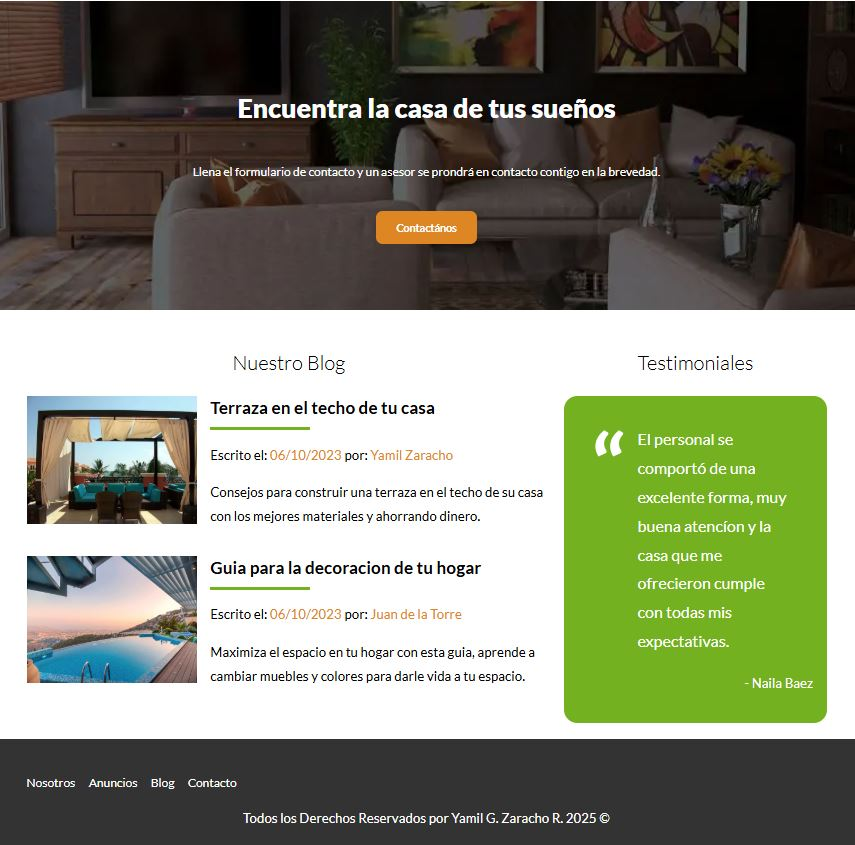

### Página de Nosotros
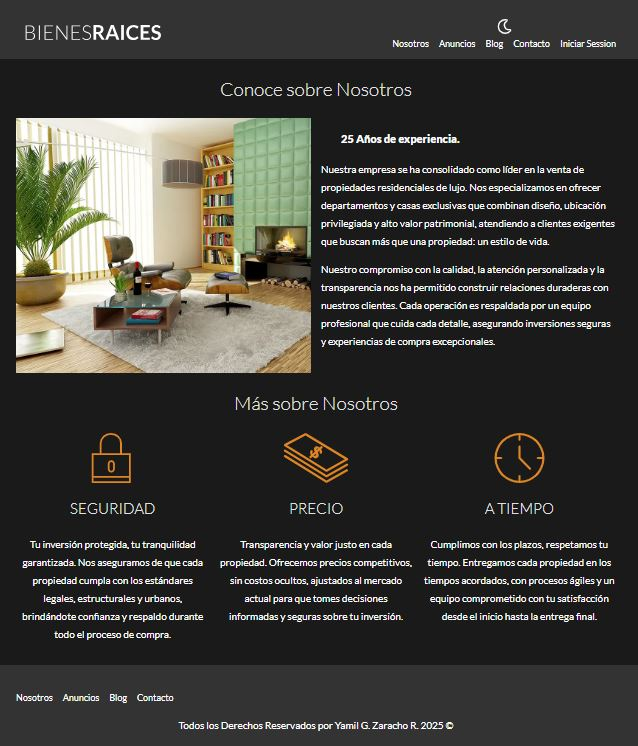

### Página de Blog
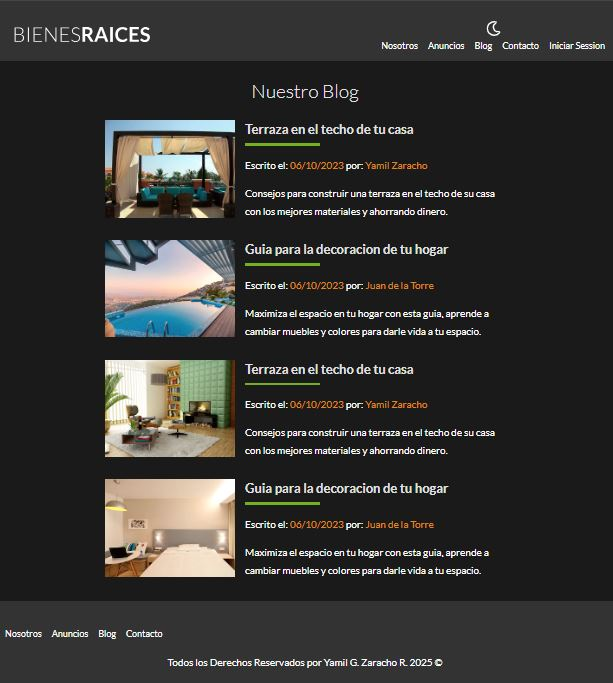

### Página de Contacto
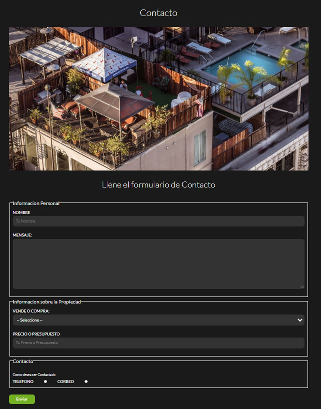

### Página de Entrada
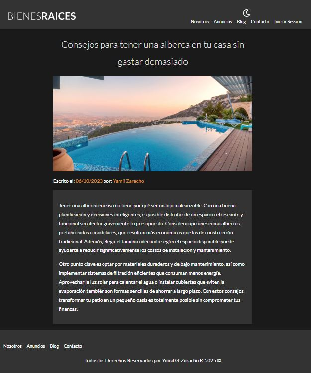

### Solicitud de Contacto por Telefono
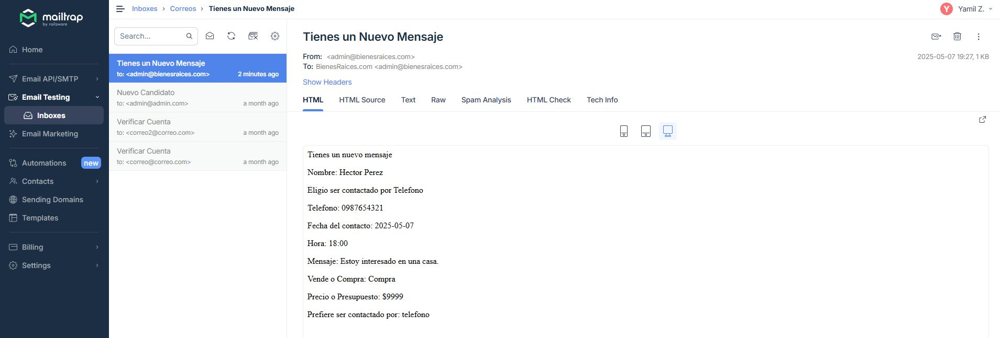

### Solicitud de Contacto por Correo
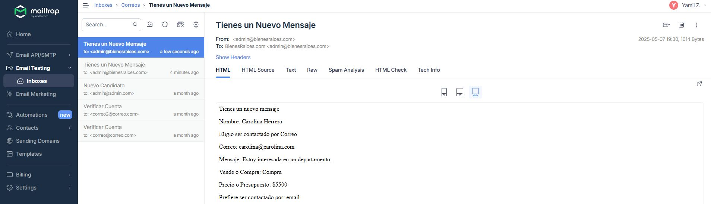

### Login
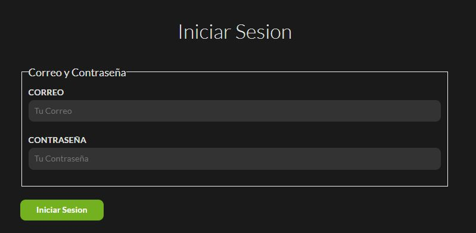

### Página de Administrador
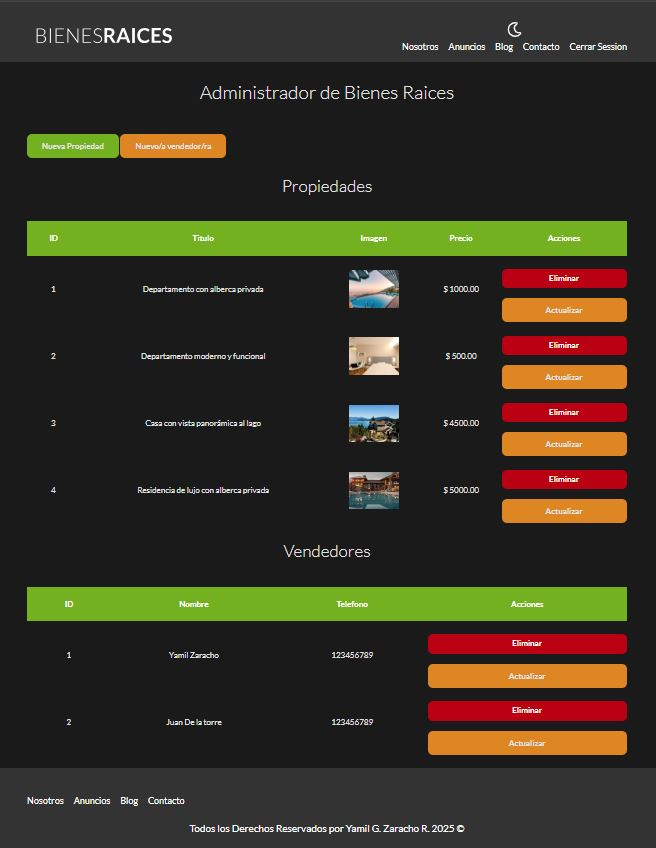

---

## 🚀 Cómo clonar y ejecutar el proyecto

1 - Clonar el repositorio
git clone https://github.com/YamilGZ/proyecto-bienesraices.git
cd proyecto-bienesraices

2 - Instalar dependencias PHP
composer install (Asegurate de tener Composer instalado)

3 - Instalar dependencias frontend
npm install (Asegurate de tener Node.js y npm instalados)

4 - Compilar archivos con Gulp
gulp

5 - Crear el archivo .env
Copiá el contenido anterior y agregá tu configuración local.

6 - Importar base de datos

- Crea una base de datos en MySQL llamada bienesraices_crud
- Importá el archivo .sql si lo tenés disponible

7 - Levantar el servidor local
Podés usar PHP embebido:
php -S localhost:3000 -t public

---

## 🧑‍💻 Autor
Desarrollado por Yamil G. Zaracho R. (YamilGZ).

---

## ⚙️ Configuración del archivo `.env`

Crea un archivo `.env` en la raíz del proyecto con el siguiente contenido:

```env
DB_HOST=localhost
DB_USER=root
DB_PASS=tu_password
DB_NAME=bienesraices_crud
